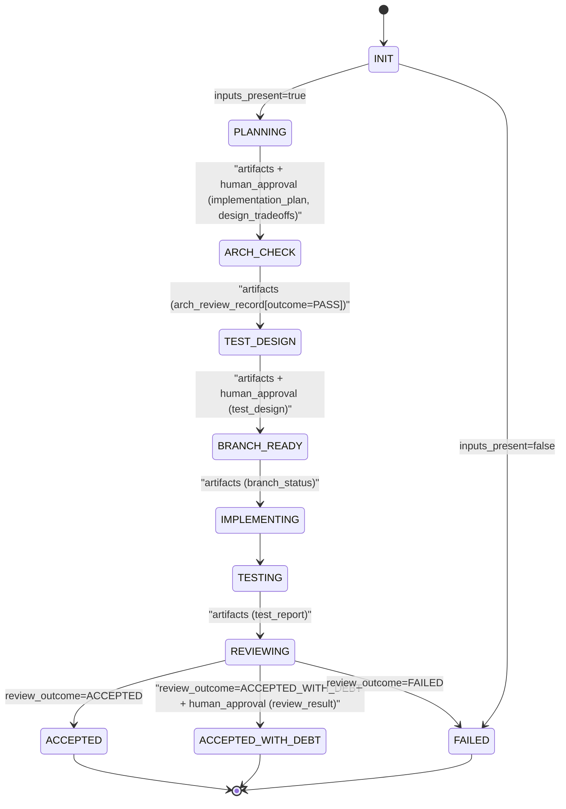
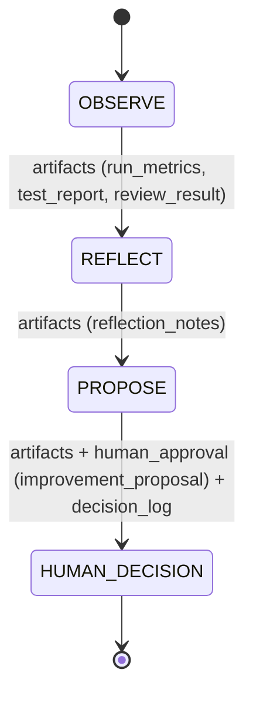
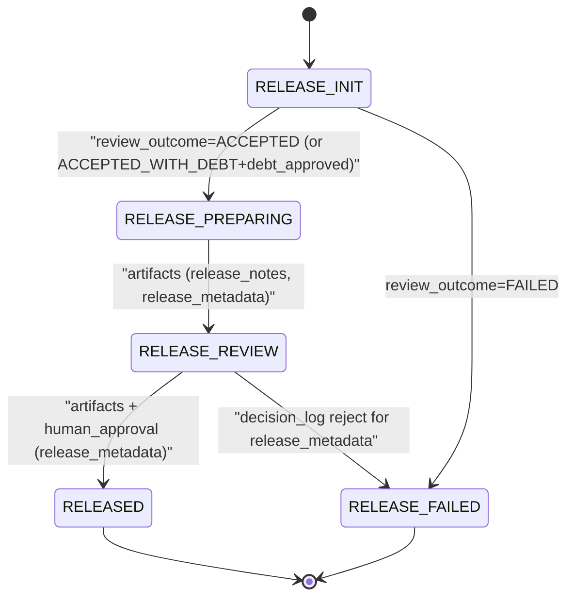

# Workflow state machine (visualization, non-normative)

This document provides a **visualization** of the workflow state machines defined by:

- `workflow/default_workflow.yaml` (primary delivery cycle)
- `workflow/improvement_cycle.yaml` (secondary improvement cycle)
- `workflow/release_workflow.yaml` (opt-in release lifecycle)

It is **derivative** and **non-normative**. The YAML files remain the source of truth.

## Primary delivery cycle (`workflow/default_workflow.yaml`)

Notes (derived from YAML, not additional logic):

- Transitions that list `human_approval` require explicit entries in `decision_log.yaml` (no implicit approvals).
- `ARCH_CHECK` requires `arch_review_record.md` with `outcome: PASS`. If `CHANGE_REQUIRED`, the workflow
  is blocked until `architecture_change_proposal.md` is approved and a new `arch_review_record.md`
  with `outcome: PASS` is produced.
- `BRANCH_READY` requires `branch_status.md` as evidence that an isolated change surface was prepared.

## Secondary improvement cycle (`workflow/improvement_cycle.yaml`)

Notes (derived from YAML, not additional logic):

- The improvement cycle produces proposals only; it never applies changes automatically.
- Outcomes may include an optional new `change_intent.yaml`, but only via explicit human decision recorded in `decision_log.yaml`.
- The improvement cycle's OBSERVE state may also trigger knowledge extraction (see `docs/knowledge_query_contract.md`).

## Release lifecycle (`workflow/release_workflow.yaml`)

Notes (derived from YAML, not additional logic):

- Release is opt-in; it is not automatically triggered after delivery acceptance.
- Release has its own `run_id`, separate from the delivery run.
- `RELEASE_REVIEW → RELEASED` requires a human approval entry in `decision_log.yaml` referencing `release_metadata.json`'s artifact_id.
- `RELEASE_REVIEW → RELEASE_FAILED` requires an explicit reject entry in `decision_log.yaml` (not a flag). This is the symmetric counterpart to the approve gate.
- `RELEASE_FAILED` is terminal; a new release run must be started to retry.

## Change log

| Version | Date | Change |
| --- | --- | --- |
| v1 | 2026-03-12 | Added Release lifecycle section for `workflow/release_workflow.yaml`. Added knowledge extraction note to improvement cycle. Updated document scope list. |
