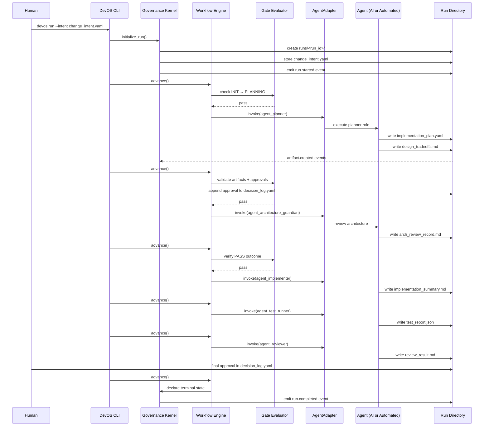

# Runtime Execution Model



**Document type**: Runtime scope reference  
**Status**: Active — MVP scope  
**Date**: 2026-03-15

---

## MVP Runtime Scope

The DevOS runtime implements exactly the following responsibilities:

| Responsibility | Module |
| --- | --- |
| Run lifecycle (init, resume, terminal detection) | `runtime/engine/run_engine.py` |
| Workflow state transitions (one per invocation) | `runtime/engine/workflow_engine.py` |
| Gate validation (four-step check procedure) | `runtime/engine/gate_evaluator.py` |
| Artifact storage, hashing, structural validation | `runtime/artifacts/artifact_system.py` |
| Decision log reading and signal return | `runtime/decisions/decision_system.py` |
| Event construction and persistence | `runtime/events/event_system.py` |
| CLI entry point (`run`, `resume`, `status`, `check`, `advance`) | `runtime/cli.py` |

The runtime does **not** do anything else. All other capabilities are future extension points.

---

## Execution Responsibility Model

DevOS enforces a strict three-way division of execution responsibility:

| Actor | Responsibility |
| --- | --- |
| **Agents** | Perform cognitive work (reasoning, synthesis, code generation). Produce all workflow artifacts. |
| **DevOS runtime** | Deterministically govern workflow execution: gate validation, state transitions, artifact validation, event recording. |
| **Human Decision Authority** | Optionally provide approvals or reviews at governance gates. Never produce artifacts. |

### Key rules

**Agents produce all artifacts.**  
Every workflow artifact — plans, reviews, implementation summaries, test reports — is produced by an agent or automated tool. No artifact is produced by a human directly.

**Agents do not control workflow execution.**  
Agents produce artifacts. The DevOS runtime reads those artifacts, validates them, and determines whether a state transition is permitted. Agents have no mechanism to advance workflow state.

**Human interaction is optional.**  
Humans interact with DevOS only by writing entries to `decision_log.yaml`. This is a governance action, not a workflow execution action. If no gate in a run requires an approval decision, the run can complete without any human input.

**DevOS can operate fully autonomously when no human decisions are required.**  
A controlled wrapper script calling `advance` iteratively is sufficient to drive a complete run when all gate conditions are satisfied by artifact outcomes alone.

### Correct mental model

```
Agents perform cognitive work and produce artifacts.
DevOS runtime deterministically governs workflow execution and system state.
Humans optionally provide decisions or reviews when governance input is required.
```

---

## What the Runtime Does NOT Implement

The following are explicitly outside the MVP runtime boundary. They are not missing features — they are deliberate exclusions.

| Excluded capability | Reason |
| --- | --- |
| **LLM invocation** | No LLM SDK in the kernel. All AI interaction occurs in external adapters. |
| **Planning logic** | DevOS does not define what should be built. That is the planning layer's responsibility. |
| **AI agent frameworks** | DevOS defines contracts for agents. External systems implement those contracts. |
| **Knowledge extraction** | Extraction trigger events are emitted at terminal states, but no extraction is performed. Future feature. |
| **Model routing** | No local/cloud model selection logic. Future feature. |
| **Semantic artifact validation** | The runtime validates artifact structure only. Content semantics are project-level concerns. |
| **External API calls** | The runtime must operate entirely from the local filesystem. No outbound HTTP calls. |
| **Autonomous run loops** | There is no run-until-done command. One transition per `advance` invocation. Permanent constraint. |
| **External state mirroring** | The runtime does not push state to Linear, GitHub, or any external system. |
| **Distributed execution** | DevOS is a single-process local CLI tool. No distributed runtime. |

---

## Run Lifecycle

A run follows this ordered lifecycle:

```
run start → workflow load → gate evaluation → artifact validation → event emission → state transition → terminal state
```

This sequence repeats state-by-state until the run reaches a terminal state (ACCEPTED, ACCEPTED_WITH_DEBT, or FAILED).

Each `advance` invocation executes **exactly one** transition attempt. The runtime does not loop autonomously. A human operator or a controlled wrapper script calls `advance` iteratively. Human intervention is not required at every gate — when gates are satisfied by artifact conditions alone, autonomous iteration is possible.

---

## Role of Core Engine Modules

- `runtime/engine/workflow_engine.py` — interprets the workflow YAML definition and manages valid state progression.
- `runtime/engine/run_engine.py` — coordinates run-level lifecycle: initialization, state reconstruction on resume, terminal state detection.
- `runtime/engine/gate_evaluator.py` — executes the four-step gate check (input presence, artifact presence, approval, conditions) before each transition.

Together, these modules provide the deterministic execution backbone that maps workflow definitions to concrete run behavior.

---

## Event Emission

Events are emitted at every significant runtime action to produce an append-only audit trail:

- `runtime/events/event_system.py` — constructs event envelopes with monotonic IDs and persists them to `run_metrics.json`.
- `runtime/events/metrics_writer.py` — handles atomic append-only writes to `run_metrics.json`.

Events form the complete, auditable execution history for a run.

---

## Artifact Persistence

Run artifacts are persisted through two store modules:

- `runtime/store/file_store.py` — atomic write, SHA-256 hashing, YAML/JSON parsing.
- `runtime/store/run_store.py` — run directory layout, path resolution, run enumeration.

All artifacts reside under `runs/<run_id>/artifacts/`. No artifact may be modified after it is approved.

---

## Future Extension Points

The following capabilities are **not part of the MVP runtime**. They are documented and parked for future development. The MVP runtime includes stub hooks and protocol interfaces that make these extensions possible without redesigning the core.

### Automated knowledge extraction

The runtime emits `knowledge.extraction_triggered` events at terminal states via `runtime/knowledge/extraction_hooks.py`. This is the integration point for a future knowledge extraction layer.

**What is excluded**: creating `knowledge_record` artifacts, writing to `knowledge_index.json`, or performing any content analysis. See `docs/roadmap/future_features.md §1–2`.

### Capability plugin execution

Semantic artifact validation (i.e., does the content make sense for this project?) is explicitly out of scope for the runtime. The `domain_validation` capability referenced in architecture docs is a future project-level extension.

**What is excluded**: capability registry loading, semantic validators, capability-driven gate checks. See `docs/roadmap/future_features.md §3`.

### Automated agent adapter execution

The `AgentAdapter` protocol (`runtime/agents/invocation_layer.py`) is defined and the `AUTOMATED` invocation mode code path exists. Concrete adapter implementations that invoke AI models are project-level concerns.

**What is excluded**: pre-built LLM adapters, subprocess agents, HTTP agent adapters. See `docs/roadmap/future_features.md §5`.

### Autonomous execution loops

The CLI does not provide a run-until-done command. Each `advance` invocation performs one transition. This is a permanent design constraint, not a missing feature.

**What is excluded**: any command that autonomously loops through transitions without an explicit external caller. This does not imply that a human must be present at each gate. A controlled wrapper script can call `advance` iteratively, and when no gate requires a human approval, the run progresses without human input.
