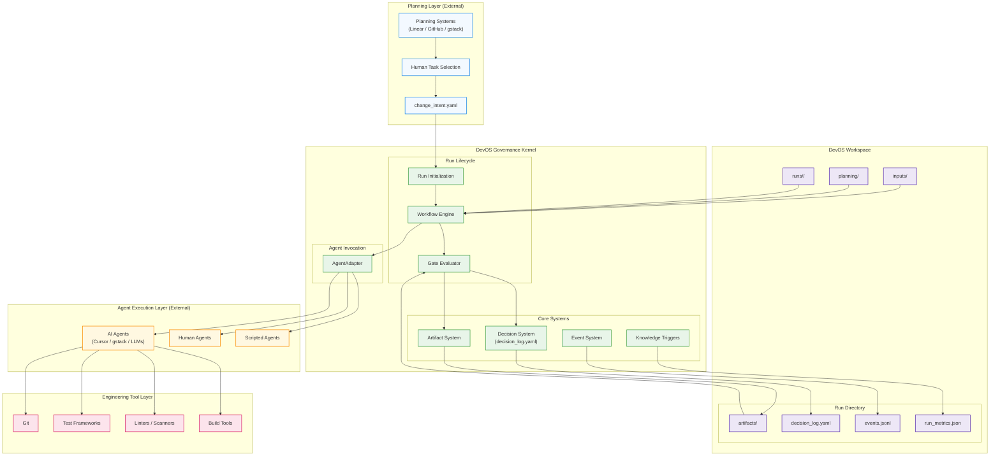

# DevOS – System Architecture Overview



**Document type**: Architecture overview
**Status**: Normative for conceptual architecture
**Date**: 2026-03-15

---

## 1. What DevOS Is

DevOS is a **workflow governance kernel for AI-assisted engineering**.

It governs how development work progresses through explicit states, artifacts, and human decisions. DevOS does not perform reasoning, generate code, or plan work. It enforces deterministic workflow execution and records every action.

The one-sentence positioning:

> DevOS is the governance layer between planning systems and AI execution systems.

---

## 2. Architectural Position

DevOS is a **deterministic workflow governance kernel for AI-assisted engineering**. It sits between planning systems and execution systems. It does not belong to either layer. External systems perform planning, reasoning, coding, and testing. DevOS ensures workflow discipline, artifact traceability, decision governance, and reproducible engineering processes.

```
Planning Layer
    (gstack / Linear / GitHub Issues / any structured task system)
         ↓
  change_intent.yaml
         ↓
DevOS Governance Kernel
    (run lifecycle / workflow transitions / artifact validation / decision logging)
         ↓
Agent Execution Layer
    (gstack agents / local LLM agents / human agents / scripts)
         ↓
Artifact output
         ↓
Gate evaluation
         ↓
State transition
         ↓
Engineering Tool Layer
    (Git / pytest / Ruff / CI pipelines / IDE assistants)
```

This four-layer separation is the defining architectural principle of DevOS. Each layer has a clearly bounded responsibility. DevOS governs the second layer entirely and coordinates with all others through artifacts.

---

## 3. System Layers

DevOS operates across four layers. The governance kernel is the second layer.

### Layer 1 — Planning

Planning defines **what should be built**.

Planning tools produce structured work items: epics, stories, and tasks. These are authored externally to DevOS and may live in systems such as:

- Linear
- GitHub Issues
- gstack
- Any structured task system

Planning output must be converted into a `change_intent.yaml` file. This YAML file is the sole entry point into a DevOS run. DevOS has no knowledge of the planning tool that produced it.

**Output contract**: `change_intent.yaml`

---

### Layer 2 — DevOS Governance Kernel

The governance kernel is the DevOS runtime and framework layer.

The kernel is responsible for:

| Responsibility | Description |
| --- | --- |
| Run lifecycle | Initialization, resumption, terminal state detection |
| Workflow transitions | State machine traversal, one transition per invocation |
| Artifact validation | Structural validation of artifacts at each gate |
| Decision logging | Reading explicit human approvals from `decision_log.yaml` |
| Event tracking | Append-only recording of every system action |

The kernel does **not**:

- Perform AI reasoning
- Generate code
- Perform planning
- Implement agent frameworks
- Maintain knowledge state across runs (future feature)

The kernel's job is deterministic workflow execution.

---

### Layer 3 — Agent Execution Layer

AI reasoning occurs outside the DevOS kernel.

DevOS defines **agent contracts** that describe:

- the role of an agent (e.g., planner, implementer, reviewer)
- the required inputs (artifacts)
- the expected outputs (artifacts)

External systems implement these contracts. Examples of possible implementations:

- Cursor agents
- gstack agents
- Local LLM-backed agents
- Manual human execution

DevOS invokes agents through an `AgentAdapter` protocol. This protocol isolates the invocation mechanism from the engine. The kernel does not know how an agent is implemented.

**Contract location**: `framework/agents/`

---

### Layer 4 — Engineering Tool Layer

External engineering tools perform concrete technical tasks and produce artifacts consumed by DevOS gates.

Examples:

| Tool category | Examples |
| --- | --- |
| Version control | Git |
| Code quality | Ruff, Pylint |
| Testing | Pytest |
| Security scanning | Semgrep, Bandit |
| Code generation | Any LLM-backed tool, IDE assistant |
| CI pipelines | GitHub Actions, GitLab CI |

Tools produce artifacts. DevOS evaluates those artifacts through gate checks. DevOS has no direct dependency on any specific tool. Any tool that writes a valid, schema-conformant artifact is compatible with DevOS.

DevOS does not implement, manage, or replace tools at this layer. Engineering tools remain owned by the engineering team.

---

## 4. The Governance Kernel in Detail

### Run Lifecycle

A run is a scoped execution of a defined workflow, bound to a single `change_intent.yaml`.

Each run:

- is assigned a stable, deterministic `run_id`
- stores all artifacts, decisions, and events under `runs/<run_id>/`
- can be resumed from any state using only the filesystem

### Workflow State Machine

The primary delivery workflow:

```
INIT
→ PLANNING
→ ARCH_CHECK
→ TEST_DESIGN
→ BRANCH_READY
→ IMPLEMENTING
→ TESTING
→ REVIEWING
→ ACCEPTED | ACCEPTED_WITH_DEBT | FAILED
```

`FAILED` is terminal. A new run is required for rework.

### Gate Validation

Every workflow transition is guarded by a four-step gate check:

1. **inputs_present** — all declared input artifacts exist
2. **artifact_presence** — the required gate artifact exists
3. **approval_check** — `decision_log.yaml` contains a matching approved entry
4. **condition_check** — the artifact outcome field matches the required value

Gate failure is hard. No fallback, no inference, no automatic retry.

### Artifact Model

Artifacts are the universal interface between all system components.

Each artifact is:

- a structured file (YAML or Markdown with required fields)
- SHA-256 hashed at creation
- immutable after approval
- stored at `runs/<run_id>/artifacts/<artifact_name>`

Artifacts are the sole communication channel between stages. Nothing passes between workflow states except through artifacts.

---

## 5. Separation of Concerns

The three concerns that DevOS explicitly separates:

| Concern | Owner | DevOS role |
| --- | --- | --- |
| Planning | External planning tools | Consumes output as `change_intent.yaml` |
| Reasoning / execution | External agents and tools | Invokes through contracts and adapters |
| Governance | DevOS kernel | Owns entirely |

This separation allows DevOS to remain independent from any planning tool, any AI provider, and any specific agent implementation.

---

## 6. Implemented vs. Future Capabilities

### Currently Implemented (MVP Runtime)

| Capability | Location |
| --- | --- |
| Run lifecycle | `runtime/engine/run_engine.py` |
| Workflow state machine | `runtime/engine/workflow_engine.py` |
| Four-step gate evaluation | `runtime/engine/gate_evaluator.py` |
| Artifact storage and validation | `runtime/artifacts/artifact_system.py` |
| Decision log reading | `runtime/decisions/decision_system.py` |
| Append-only event system | `runtime/events/event_system.py` |
| CLI (`run`, `resume`, `status`, `check`, `advance`) | `runtime/cli.py` |
| AgentAdapter protocol (interface only) | `runtime/agents/invocation_layer.py` |
| Knowledge extraction trigger events (stubs) | `runtime/knowledge/extraction_hooks.py` |

### Future Extension Areas

| Capability | Reference |
| --- | --- |
| Concrete AgentAdapter implementations | `docs/roadmap/future_features.md` |
| Knowledge record extraction and indexing | `docs/roadmap/future_features.md` |
| LLM provider abstraction layer | `docs/architecture/llm_strategy.md` |
| gstack agent integration | `docs/architecture/agent_contracts.md` |
| External tool adapters (Linear, GitHub, etc.) | `docs/architecture/integration_model.md` |
| Capability plugin system | `docs/roadmap/future_features.md` |
| Automated improvement cycles | `docs/roadmap/future_features.md` |
| Model routing (local vs. cloud) | `docs/roadmap/hybrid_ai_runtime.md` |

---

## 7. Design Constants

These properties of the DevOS kernel are permanent and not subject to extension:

- **One transition per `advance` invocation.** The CLI does not loop autonomously.
- **No hidden state.** All state is reconstructed from the filesystem on every invocation.
- **No semantic interpretation.** The kernel validates artifact structure, not content meaning.
- **No implicit approvals.** All gate approvals require an explicit `decision_log.yaml` entry.
- **No external service dependency.** DevOS must operate entirely from the local filesystem.

---

## Further Reading

- `docs/vision/product_vision.md` — MVP scope, principles, and non-goals
- `docs/architecture/development_pipeline.md` — Full planning-to-execution pipeline
- `docs/architecture/agent_contracts.md` — Agent contract model and external implementations
- `docs/architecture/integration_model.md` — Artifact-first integration philosophy
- `docs/architecture/llm_strategy.md` — LLM independence and provider abstraction
- `docs/architecture/devos_architecture.md` — Runtime module architecture reference
- `docs/roadmap/future_features.md` — Capabilities parked outside the MVP runtime
