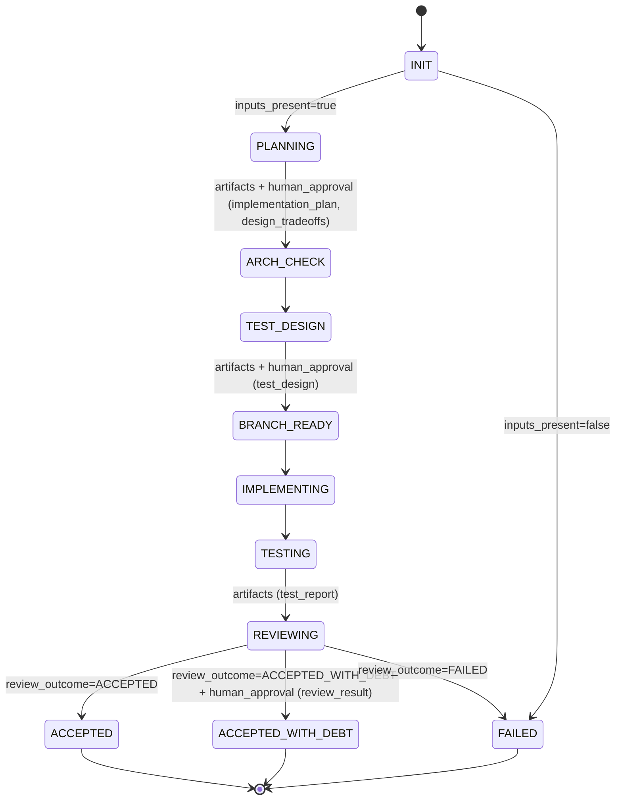
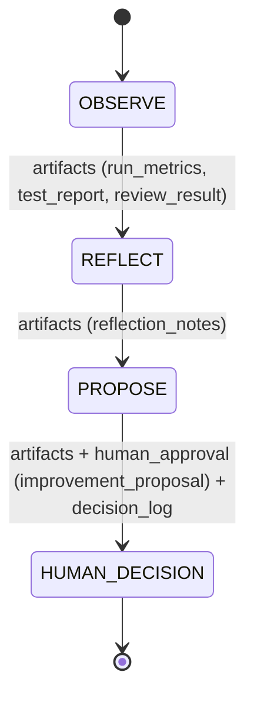

# Workflow state machine (visualization, non-normative)

This document provides a **visualization** of the workflow state machines defined by:

- `workflow/default_workflow.yaml` (primary delivery cycle)
- `improvement/improvement_cycle.yaml` (secondary improvement cycle)

It is **derivative** and **non-normative**. The YAML files remain the source of truth.

## Primary delivery cycle (`workflow/default_workflow.yaml`)

Notes (derived from YAML, not additional logic):

- Transitions that list `human_approval` require explicit entries in `decision_log.yaml` (no implicit approvals).
- `ARCH_CHECK` is a governance gate; if an architecture change is required, it must be captured explicitly via `architecture_change_proposal.md`.

## Secondary improvement cycle (`improvement/improvement_cycle.yaml`)

Notes (derived from YAML, not additional logic):

- The improvement cycle produces proposals only; it never applies changes automatically.
- Outcomes may include an optional new `change_intent.yaml`, but only via explicit human decision recorded in `decision_log.yaml`.
